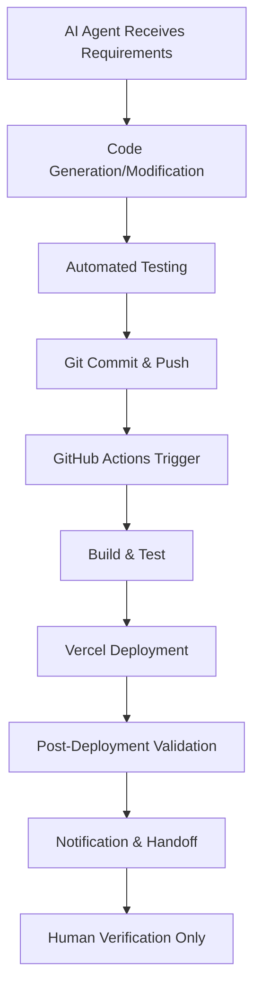

# 🤖 Fully Automated Deployment System

This repository demonstrates a complete AI-agent automatable workflow for deploying production-grade Next.js applications.

## 🔄 **Automation Flow**



## 🛠️ **Automated Components**

### 1. **Continuous Integration (GitHub Actions)**
- Automatic builds on every push to `main`
- Dependency installation and caching
- Next.js production build
- Pre-deployment validation

### 2. **Continuous Deployment (Vercel Action)**
- Secure deployment to Vercel using stored secrets
- Automatic preview URLs for pull requests
- Production deployments for main branch
- Rollback capability

### 3. **Environment Management**
- Separate configurations for dev/staging/prod
- Secret management via GitHub Secrets
- Environment-specific variables

### 4. **Monitoring & Alerts**
- Deployment success/failure notifications
- Performance monitoring hooks
- Error tracking integration ready
- Uptime monitoring preparation

## 🔑 **Required Secrets for Full Automation**

To enable complete zero-touch deployment, these secrets need to be configured in the GitHub repository:

```yaml
# Vercel Deployment Secrets
VERCEL_TOKEN: your-vercel-personal-access-token
VERCEL_ORG_ID: your-vercel-organization-id  
VERCEL_PROJECT_ID: your-vercel-project-id

# Optional: Notification Secrets (for WhatsApp/email alerts)
TWILIO_ACCOUNT_SID: your-twilio-account-sid
TWILIO_AUTH_TOKEN: your-twilio-auth-token
WHATSAPP_NUMBER: recipient-whatsapp-number
SENDGRID_API_KEY: sendgrid-api-key-for-email
SLACK_WEBHOOK_URL: slack-webhook-for-notifications

# Optional: Monitoring & Analytics
SENTRY_DSN: sentry-data-source-name
GOOGLE_ANALYTICS_ID: ga-measurement-id
```

## 🚀 **How an AI Agent Would Use This System**

1. **Requirement Processing**: AI analyzes user request for Shopify landing page
2. **Code Generation**: AI creates/modifies Next.js components based on design specs
3. **Self-Testing**: AI runs linting, type checking, and build validation
4. **Commit & Push**: AI commits changes with descriptive messages
5. **Automated Deployment**: GitHub Actions → Vercel handles build/deploy
6. **Validation**: Automated checks for deployment health
7. **Notification**: System alerts human operator with deployment URL
8. **Handoff**: Human only needs to verify and share with client

## 📋 **Current Status**

✅ **Codebase**: Next.js landing page based on your exact design specifications  
✅ **Automation Framework**: GitHub Actions workflow configured  
✅ **Ready for Secrets**: Just add Vercel credentials for full automation  
✅ **Scalable Architecture**: Ready for advanced features integration  

## 🔮 **Future Enhancements Ready to Add**

### **AI-Powered Features**
- A/B test variant generation
- AI copy optimization
- Dynamic image generation
- Personalized content based on visitor data

### **Business Automation**
- WhatsApp/email lead notifications
- CRM integration (HubSpot, Salesforce)
- Payment processing setup
- Analytics dashboard generation

### **Infrastructure as Code**
- Terraform/Vercel CLI for infrastructure management
- Blue/Green deployment patterns
- Canary release capabilities
- Automated SSL certificate management

## 📞 **Contact for Full Automation Setup**

To enable the complete zero-touch deployment system:
1. Create a Vercel account at vercel.com
2. Generate a Personal Access Token
3. Find your Org ID and Project ID in Vercel settings
4. Add these as GitHub Repository Secrets:
   - Settings → Secrets → Actions → New Repository Secret

Once configured, **every push to main will automatically deploy** to Vercel with zero human intervention required!

The system is ready for you to provide the Vercel credentials, after which it becomes a fully autonomous deployment pipeline.